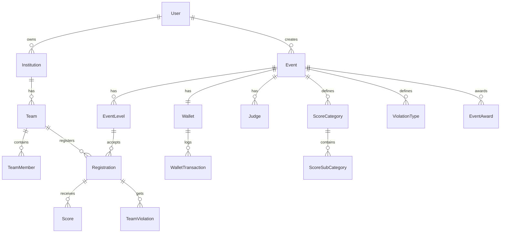

<p align="center">
  <h1 align="center">🏅 PaskiHub Backend API</h1>
  <p align="center">
    Platform manajemen event Paskibra — pendaftaran, penilaian, dan pengelolaan kompetisi berbaris-berbaris secara digital.
  </p>
</p>

<p align="center">
  
  
  
  
  
  
</p>

---

## 📖 Deskripsi

**PaskiHub** adalah platform backend REST API untuk manajemen event Paskibra (Pasukan Pengibar Bendera). Sistem ini menyediakan fitur lengkap mulai dari pendaftaran peserta, manajemen tim & institusi, pengelolaan event dan kompetisi, sistem penilaian juri, hingga pengelolaan wallet digital untuk pembayaran event.

### Fitur Utama

| Fitur | Deskripsi |
|---|---|
| 🔐 **Autentikasi & Otorisasi** | JWT-based auth dengan role-based access (Admin, Organizer, Peserta) |
| 📋 **Manajemen Event** | CRUD event, level kompetisi, upload logo & poster |
| 👥 **Manajemen Tim** | Pendaftaran tim, anggota, institusi asal |
| 📝 **Registrasi Kompetisi** | Alur registrasi lengkap dengan status pembayaran (DP/Lunas) |
| ⚖️ **Sistem Penilaian** | Form penilaian, kategori skor, juri, pelanggaran, rekap nilai |
| 💰 **Wallet Digital** | Top-up, approval admin, coin system, transaction log |
| 🏆 **Event Award** | Penghargaan & ranking berdasarkan kategori skor |
| 👤 **Panel Admin** | User management, ban/unban, verifikasi, monitoring event |
| 📊 **Dashboard** | Statistik & overview data untuk organizer |
| ⚙️ **System Settings** | Konfigurasi global (coin rate, approval fee, bank info) |
| 📧 **Email Service** | Verifikasi email & forgot password via SMTP (Gomail) |
| ⏰ **Cron Jobs** | Pembersihan otomatis akun yang belum terverifikasi |

---

## 🏗️ Arsitektur

Project ini menggunakan **Clean Architecture** dengan pola modular:

```
paskihub-be/
├── cmd/app/                    # Entry point aplikasi
│   └── main.go
├── domain/                     # Domain layer (entities, contracts, DTOs)
│   ├── entity/                 # Database models (GORM)
│   ├── contracts/              # Interface kontrak (repository & service)
│   ├── dto/                    # Data Transfer Objects (request/response)
│   ├── enums/                  # Enum types (Role, EventStatus, dll)
│   └── errors.go               # Domain error definitions
├── internal/                   # Internal application layer
│   ├── app/                    # Business modules (controller/service/repository)
│   │   ├── user/               # Autentikasi & manajemen user
│   │   ├── event/              # Manajemen event & level
│   │   ├── wallet/             # Wallet & transaksi
│   │   ├── assessment/         # Penilaian (form, rekap, score)
│   │   ├── participant_profile/# Profil peserta
│   │   ├── participant_team/   # Tim peserta
│   │   ├── participant_event/  # Event peserta
│   │   ├── participant_assessment/ # Penilaian peserta
│   │   ├── eo/                 # Event Organizer management
│   │   ├── eo_team/            # EO team management
│   │   ├── dashboard/          # Dashboard & statistik
│   │   ├── system_setting/     # Pengaturan sistem
│   │   ├── private_file/       # Akses file privat
│   │   └── log/                # Logging module
│   ├── infra/                  # Infrastructure layer
│   │   ├── database/           # PostgreSQL connection, migration & seeder
│   │   ├── env/                # Environment configuration (Viper)
│   │   └── server/             # HTTP server setup & routing (Fiber)
│   └── middlewares/            # Middleware (auth, CORS, rate limiter, API key)
├── pkg/                        # Shared packages / utilities
│   ├── bcrypt/                 # Password hashing
│   ├── fiber/                  # Custom Fiber validators
│   ├── gomail/                 # Email service
│   ├── helpers/                # HTTP response helpers, flags
│   ├── html/                   # HTML template helpers
│   ├── jwt/                    # JWT token management
│   ├── log/                    # Structured logging (Logrus)
│   ├── redis/                  # Redis client wrapper
│   ├── time/                   # Time utilities
│   └── uuid/                   # UUID generator
├── docs/                       # Swagger API documentation (auto-generated)
├── public/uploads/             # File upload publik (logo event, logo tim)
├── storage/private/            # File upload privat (pembayaran, KTP, foto)
├── data/                       # Data logs & seeders
├── Dockerfile                  # Multi-stage Docker build
├── docker-compose.yml          # Full stack deployment
└── .air.toml                   # Hot-reload config (Air)
```

Setiap modul di `internal/app/` mengikuti pola **Controller → Service → Repository**:

```
module/
├── controller/     # HTTP handler, request parsing, response
├── service/        # Business logic
└── repository/     # Database query (GORM)
```

---

## 🛠️ Tech Stack

| Kategori | Teknologi |
|---|---|
| **Language** | Go 1.24.3 |
| **Framework** | [Fiber v2](https://gofiber.io/) |
| **Database** | PostgreSQL 17 (via GORM) |
| **Cache** | Redis 7 |
| **Auth** | JWT (golang-jwt/v5) + Bcrypt |
| **Validation** | go-playground/validator v10 |
| **API Docs** | Swagger (swaggo/swag) |
| **Email** | Gomail (SMTP) |
| **Config** | Viper (.env) |
| **Logging** | Logrus + LFShook (file rotation) |
| **Scheduler** | robfig/cron v3 |
| **Container** | Docker + Docker Compose |
| **Hot Reload** | Air |

---

## ⚡ Quick Start

### Prasyarat

- **Go** ≥ 1.24.3
- **PostgreSQL** ≥ 15
- **Redis** ≥ 7
- **Air** (opsional, untuk hot-reload development)

### 1. Clone Repository

```bash
git clone https://github.com/BangNopall/paskihub-be.git
cd paskihub-be
```

### 2. Konfigurasi Environment

Buat file `.env` dari template:

```bash
cp .env.docker.example .env
```

Edit file `.env` sesuai konfigurasi lokal:

```env
APP_ENV=development
APP_PORT=3080
API_KEY=your-api-key

DB_HOST=localhost
DB_PORT=5432
DB_USER=postgres
DB_PASS=your-db-password
DB_NAME=paskihub

GOMAIL_HOST=smtp.gmail.com
GOMAIL_PORT=587
GOMAIL_USERNAME=your-email@gmail.com
GOMAIL_PASSWORD=your-app-password

REDIS_HOST=localhost
REDIS_PORT=6379
REDIS_PASS=your-redis-password

# JWT_EXP_TIME dalam jam. Contoh: 1
JWT_SECRET_KEY=your-jwt-secret
JWT_EXP_TIME=1
```

### 3. Install Dependencies

```bash
go mod download
```

### 4. Jalankan Aplikasi

**Development (dengan hot-reload):**
```bash
air
```

**Atau manual:**
```bash
go run cmd/app/main.go
```

Server akan berjalan di `http://localhost:3080`

---

## 🐳 Docker Deployment

### Quick Deploy (Docker Compose)

```bash
# Buat konfigurasi environment
cp .env.docker.example .env
# Edit .env sesuai kebutuhan

# Build & jalankan semua service
docker compose up -d --build
```

Ini akan menjalankan 3 container:
- **paskihub-be** — Aplikasi Go (port `3080`)
- **paskihub-postgres** — PostgreSQL 17 (port `2020` → `5432`)
- **paskihub-redis** — Redis 7 (port `2021` → `6379`)

### Docker Service Details

| Service | Container | Port Mapping |
|---|---|---|
| App | `paskihub-be` | `APP_PORT:APP_PORT` |
| PostgreSQL | `paskihub-postgres` | `127.0.0.1:2020:5432` |
| Redis | `paskihub-redis` | `2021:6379` |

### Persistent Volumes

| Volume | Mount Point | Deskripsi |
|---|---|---|
| `paskihub_uploads` | `/app/public/uploads` | File upload publik |
| `paskihub_private_uploads` | `/app/storage/private` | File upload privat |
| `paskihub_logs` | `/app/data/logs` | Application logs |
| `paskihub_postgres_data` | PostgreSQL data | Database storage |
| `paskihub_redis_data` | Redis data | Cache storage |

---

## 🗃️ Database

### Auto Migration

Aplikasi secara otomatis menjalankan migrasi database saat startup, termasuk:
- Pembuatan custom PostgreSQL ENUM types
- Auto-migrate semua tabel via GORM
- Seeding default system settings

### Fresh Migration

```bash
# Development
go run cmd/app/main.go --fresh

# Production (akan meminta konfirmasi)
go run cmd/app/main.go --fresh
```

> ⚠️ **Peringatan:** `--fresh` akan **menghapus semua tabel** dan membuat ulang dari awal.

### Database Seeder

```bash
# Jalankan semua seeder
go run cmd/app/main.go --seed

# Seeder model tertentu
go run cmd/app/main.go --seed --seeder=User
go run cmd/app/main.go --seed --seeder=Demo
```

### Entity Relationship



---

## 📡 API Endpoints

Base URL: `http://localhost:3080`

Semua endpoint memerlukan header `x-api-key` untuk autentikasi API.

### 🔐 Authentication
| Method | Endpoint | Deskripsi | Auth |
|---|---|---|---|
| `POST` | `/api/v1/users/register/:role` | Register user baru (eo/peserta) | API Key |
| `POST` | `/api/v1/users/login` | Login user | API Key |
| `POST` | `/api/v1/users/logout` | Logout user | Bearer |
| `GET` | `/api/v1/users/verify-email/:email/:token` | Verifikasi email | API Key |
| `POST` | `/api/v1/users/forgot-password` | Request reset password | API Key |
| `PUT` | `/api/v1/users/reset-password/:token` | Reset password | API Key |
| `GET` | `/api/v1/users/show/:userId` | Get user detail | Bearer |

### 📋 Events (Organizer)
| Method | Endpoint | Deskripsi | Auth |
|---|---|---|---|
| `POST` | `/api/v1/events/create` | Buat event baru | Organizer |
| `GET` | `/api/v1/events/user/:userId` | Lihat event milik user | Organizer |
| `PUT` | `/api/v1/events/update/:id` | Update event | Organizer |
| `DELETE` | `/api/v1/events/delete/:id` | Hapus event | Organizer |
| `POST` | `/api/v1/events/upload/:id/logo` | Upload logo event | Organizer |
| `POST` | `/api/v1/events/upload/:id/poster` | Upload poster event | Organizer |
| `POST` | `/api/v1/events/:id/levels` | Buat level kompetisi | Organizer |
| `PUT` | `/api/v1/events/:id/levels/:levelId` | Update level | Organizer |
| `DELETE` | `/api/v1/events/:id/levels/:levelId` | Hapus level | Organizer |

### 💰 Wallets
| Method | Endpoint | Deskripsi | Auth |
|---|---|---|---|
| `GET` | `/api/v1/wallets/:eventId` | Info wallet event | Organizer |
| `GET` | `/api/v1/wallets/:eventId/logs` | Transaction logs | Organizer |
| `POST` | `/api/v1/wallets/:eventId/topup` | Request top-up | Organizer |
| `GET` | `/api/v1/wallets/admin/transactions` | Semua transaksi | Admin |
| `PUT` | `/api/v1/wallets/admin/transactions/:id/approve` | Approve top-up | Admin |
| `PUT` | `/api/v1/wallets/admin/transactions/:id/reject` | Reject top-up | Admin |

### 👤 Peserta (Participant)
| Method | Endpoint | Deskripsi | Auth |
|---|---|---|---|
| `GET/PUT` | `/api/v1/peserta/profile` | Profil peserta | Peserta |
| `*` | `/api/v1/peserta/teams` | Manajemen tim | Peserta |
| `*` | `/api/v1/peserta/events` | Event yang diikuti | Peserta |
| `*` | `/api/v1/peserta/assessments` | Penilaian peserta | Peserta |

### 🛡️ Admin Panel
| Method | Endpoint | Deskripsi | Auth |
|---|---|---|---|
| `GET` | `/api/v1/admin/users` | Daftar semua user | Admin |
| `GET` | `/api/v1/admin/users/:userId` | Detail user | Admin |
| `PUT` | `/api/v1/admin/users/:userId/ban` | Ban user | Admin |
| `PUT` | `/api/v1/admin/users/:userId/unban` | Unban user | Admin |
| `PUT` | `/api/v1/admin/users/:userId/verify` | Verifikasi user | Admin |
| `PUT` | `/api/v1/admin/users/:userId/archive` | Archive organizer | Admin |
| `PUT` | `/api/v1/admin/users/:userId/unarchive` | Unarchive organizer | Admin |
| `PUT` | `/api/v1/admin/events/:eventId/status` | Update status event | Admin |
| `GET` | `/api/v1/admin/admins` | Daftar admin | Admin |
| `POST` | `/api/v1/admin/admins` | Buat admin baru | Admin |
| `DELETE` | `/api/v1/admin/admins/:id` | Hapus admin | Admin |
| `POST` | `/api/v1/admin/admins/:id/reset-password` | Reset password admin | Admin |

### 📚 Swagger Documentation

Tersedia di mode **development** saja:
```
GET /swagger/*
```

Akses via browser: `http://localhost:3080/swagger/index.html`

---

## 🔒 Autentikasi & Keamanan

### Security Layers

1. **API Key** — Header `x-api-key` wajib untuk semua request
2. **JWT Bearer Token** — Token auth di header `Authorization: Bearer {token}`
3. **Role-Based Access** — Middleware memvalidasi role (Admin/Organizer/Peserta)
4. **Email Verification** — Verifikasi email sebelum akses penuh
5. **Rate Limiter** — Pembatasan request untuk mencegah abuse
6. **CORS** — Cross-Origin Resource Sharing middleware
7. **Password Hashing** — Bcrypt untuk penyimpanan password
8. **Redis Blacklist** — Token blacklisting saat logout

### User Roles

| Role | Akses |
|---|---|
| **Admin** | Full access: user management, approval transaksi, system settings |
| **Organizer** | Membuat & mengelola event, wallet, penilaian |
| **Peserta** | Mendaftar event, kelola tim, lihat penilaian |

---

## 📂 File Storage

### Public Files
Dapat diakses langsung via URL:
- Event logos: `/public/uploads/events/`
- Team logos: `/public/uploads/teams/logos/`

### Private Files
Diakses melalui API endpoint khusus (memerlukan autentikasi):
- Payment proofs: `storage/private/payments/`
- Pelunasan proofs: `storage/private/payments_pelunasan/`
- Team ID cards: `storage/private/teams/id_cards/`
- Team photos: `storage/private/teams/photos/`
- Recommendation letters: `storage/private/teams/rekomendasi/`
- Wallet proofs: `storage/private/wallets/`

---

## 🧪 Testing

```bash
# Jalankan semua test
go test ./...

# Test dengan verbose output
go test -v ./...

# Test modul tertentu
go test ./internal/middlewares/...
go test ./internal/app/participant_event/...
```

---

## ⚙️ Environment Variables

| Variable | Deskripsi | Default | Required |
|---|---|---|---|
| `APP_ENV` | Mode aplikasi (`development` / `production`) | - | ✅ |
| `APP_PORT` | Port server | `3080` | ✅ |
| `API_KEY` | API key untuk autentikasi header | - | ✅ |
| `DB_HOST` | PostgreSQL host | - | ✅ |
| `DB_PORT` | PostgreSQL port | `5432` | ✅ |
| `DB_USER` | PostgreSQL username | - | ✅ |
| `DB_PASS` | PostgreSQL password | - | ✅ |
| `DB_NAME` | PostgreSQL database name | - | ✅ |
| `GOMAIL_HOST` | SMTP host | `smtp.gmail.com` | ✅ |
| `GOMAIL_PORT` | SMTP port | `587` | ✅ |
| `GOMAIL_USERNAME` | SMTP email | - | ✅ |
| `GOMAIL_PASSWORD` | SMTP app password | - | ✅ |
| `REDIS_HOST` | Redis host | - | ✅ |
| `REDIS_PORT` | Redis port | `6379` | ✅ |
| `REDIS_PASS` | Redis password | - | ✅ |
| `JWT_SECRET_KEY` | Secret key untuk JWT signing | - | ✅ |
| `JWT_EXP_TIME` | JWT expire time (dalam jam) | `1` | ✅ |

---

## 📝 CLI Flags

| Flag | Deskripsi |
|---|---|
| `--fresh` | Drop semua tabel dan migrasi ulang |
| `--seed` | Jalankan database seeder |
| `--seeder=<Model>` | Seeder model spesifik (`User`, `Demo`) |

**Contoh:**
```bash
go run cmd/app/main.go --fresh --seed --seeder=Demo
```

---

## 🤝 Contributing

1. Fork repository ini
2. Buat branch fitur (`git checkout -b feature/fitur-baru`)
3. Commit perubahan (`git commit -m 'Tambah fitur baru'`)
4. Push ke branch (`git push origin feature/fitur-baru`)
5. Buat Pull Request

---

## 📄 License

Project ini dikembangkan untuk keperluan manajemen event Paskibra Indonesia.

---

<p align="center">
  Built with ❤️ using Go & Fiber
</p>
